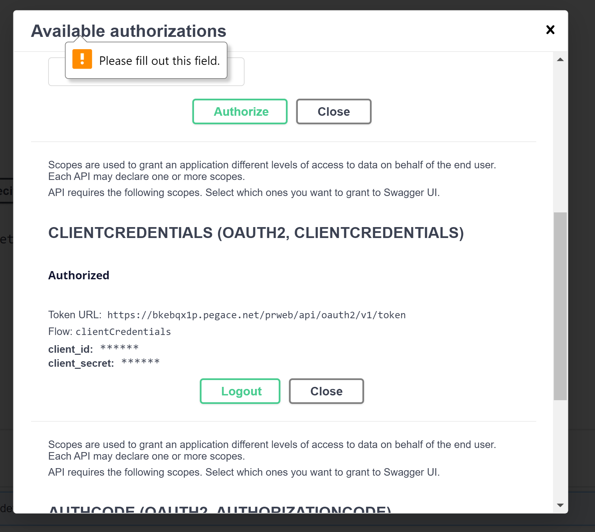

[set up credentials to authorize DX API](https://docs-previous.pega.com/pega-digital-experience-dx-api-overview/87/creating-authorization-dx-api-tests)

accessing DX API:
go to resources (the question mark)
select pega api

[DX API Docs](https://academy.pega.com/topic/constellation-dx-api/v1)

To authorize, select the second option and paste the saved client credentials

