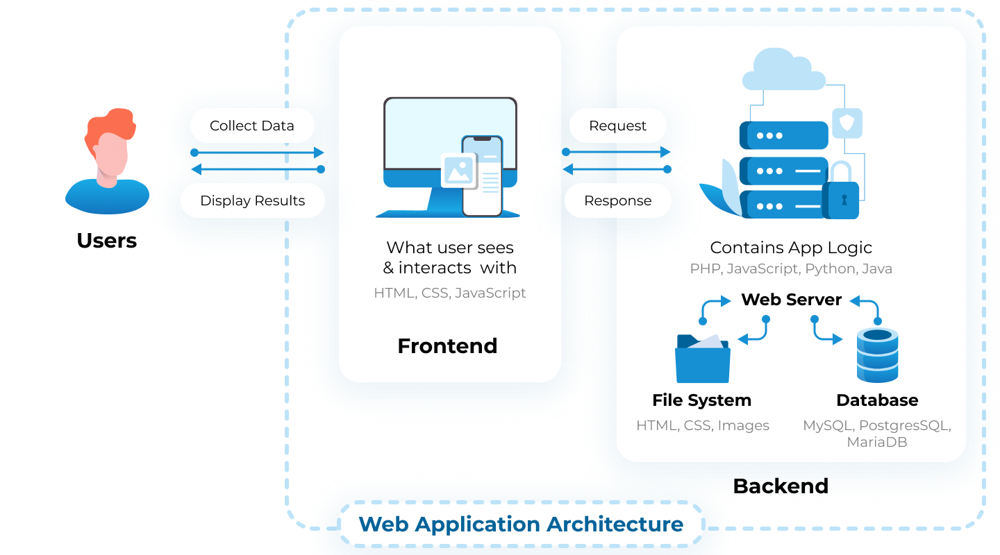

# Introduction to Transactional Applications
## What are transactional applications
Transactional applications in programming refer to software systems or applications that manage transactions reliably and securely. A transaction in this context typically involves a series of operations or actions that need to be performed as a single, atomic unit of work. These applications ensure that transactions are executed in a consistent and reliable manner, even in the presence of failures or errors.

Here are some key characteristics and aspects of transactional applications:

1. **ACID Properties**: Transactional applications adhere to the ACID properties, which stand for Atomicity, Consistency, Isolation, and Durability. These properties ensure that transactions are processed reliably and consistently, even in the presence of failures. Atomicity ensures that transactions are either fully completed or fully aborted, Consistency ensures that the database remains in a valid state before and after transactions, Isolation ensures that transactions do not interfere with each other, and Durability ensures that committed transactions persist even after system failures.

2. **Database Management Systems (DBMS)**: Transactional applications often rely on database management systems to store and manage data. DBMSs provide features such as transaction management, concurrency control, and data durability, which are essential for building transactional applications.

3. **Concurrency Control**: Transactional applications must handle concurrent access to data by multiple users or processes. Concurrency control mechanisms, such as locking, multiversion concurrency control (MVCC), or optimistic concurrency control, are used to ensure that transactions do not interfere with each other and that data remains consistent.

4. **Rollback and Recovery**: Transactional applications implement mechanisms for rolling back transactions in case of errors or failures. This ensures that the system remains in a consistent state even if a transaction encounters an error midway. Additionally, mechanisms for recovering from system failures, such as database backups and transaction logs, are essential for ensuring data durability and integrity.

5. **Logging and Auditing**: Transactional applications often include logging and auditing mechanisms to record transactions and changes to data. This information is useful for troubleshooting, auditing, and ensuring compliance with regulatory requirements.

Examples of transactional applications include online banking systems, e-commerce platforms, reservation systems, and enterprise resource planning (ERP) systems. These applications rely on transactional processing to ensure data consistency, reliability, and integrity, even under high concurrency and in the presence of failures.

**Note** : Pega is mostly suited for transactional applications 
## Basic Architecture of an Application
Every application has 3 basic parts:
Data storage, Backend, Frontend (UI)
